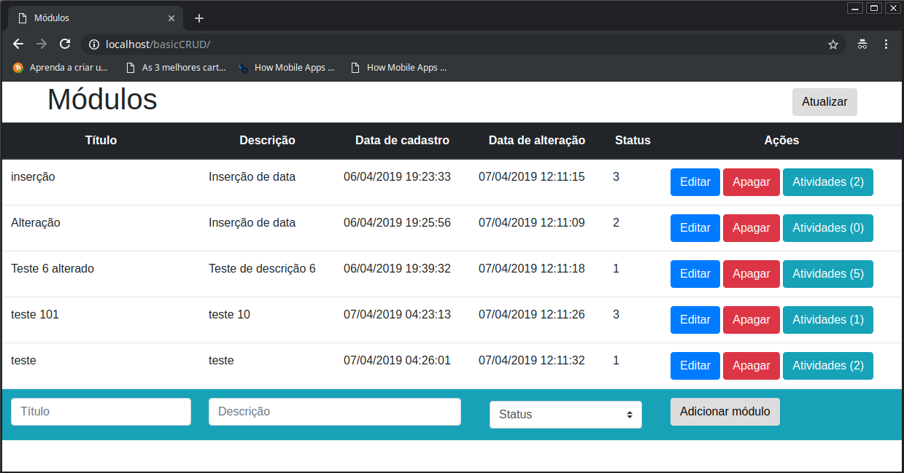
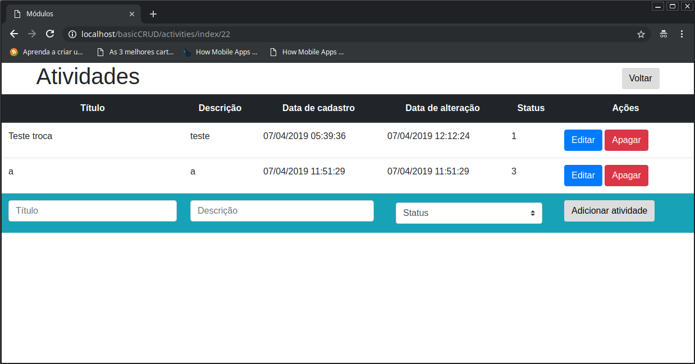
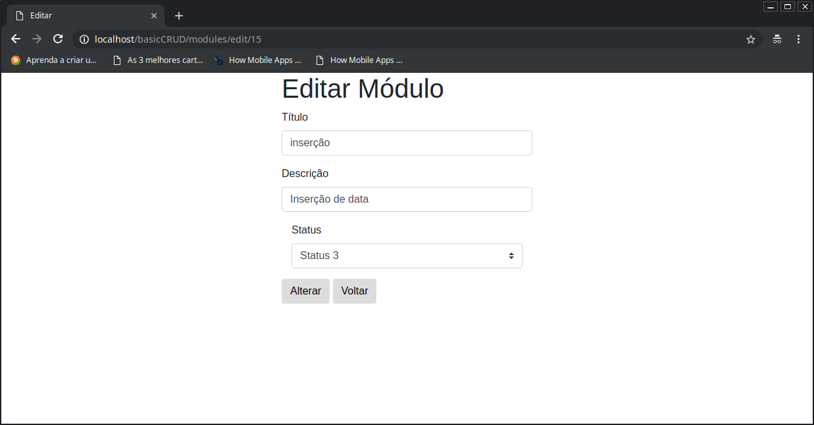

# ListCRUD

A CRUD of lists in MVC with autoload and a simple persistence framework.

Here you'll find three pages where you can get a list and a sublist. Additionally, you can add itens, edit itens and delete any of the items in those lists.

## Minimum Requirements

- PHP 7
- apache 2.4.29 with Rewrite mode enabled
- MySQL 5.7.25

## Installation

Clone this repository and create the database in your database manager. Use the file "database.sql" at the root of this project. Put the database access data in the config.php file in the config folder.

```
$ git clone git@github.com:edigar/basicCRUD-PHP.git basicCRUD
$ cd basicCRUD
$ cat database.sql
```
Copy the output of the content into your database manager and execute. An access interface, such as MySQL Workbench, makes it easy to use.

```
$ cd config
$ nano config.php
```
Add the database access data, such as database name, username and password.

On your browser access localhost/basicCRUD/ and voilà. Enjoy listing... ;)

## Screenshots

Bellow are some pictures depicted in the CRUD. In this case, the edit screen is the same for modules and activities.

### Screen modules



### Screen activities



### Screen edit

